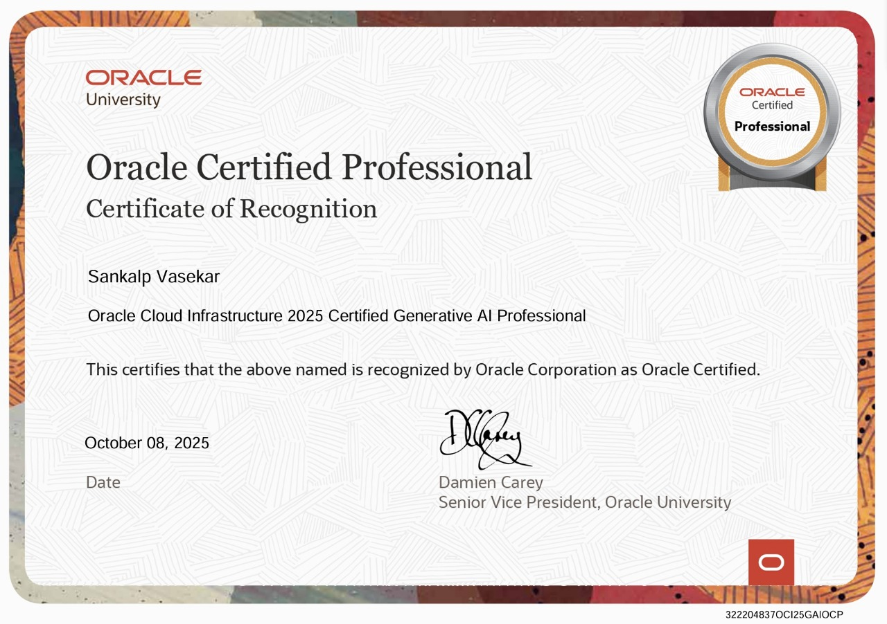
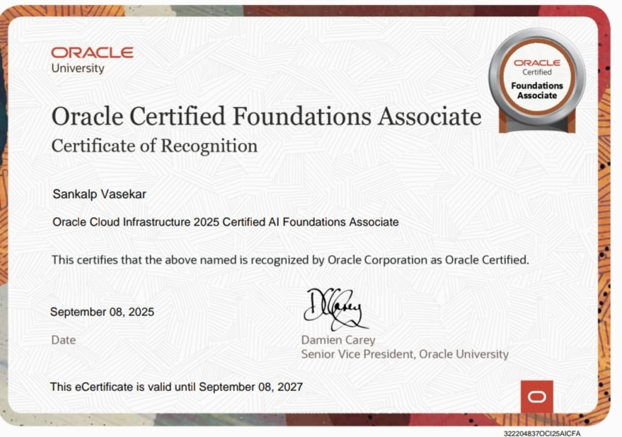
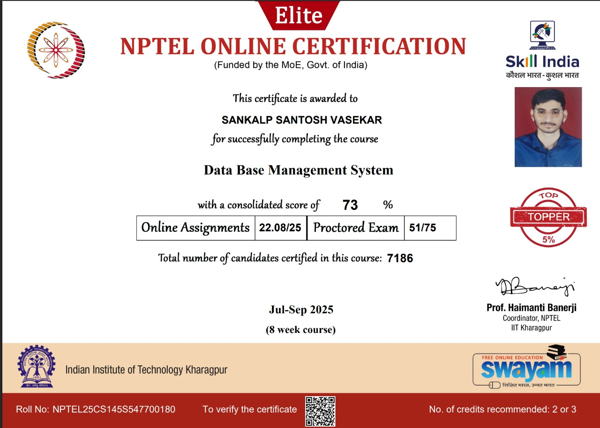
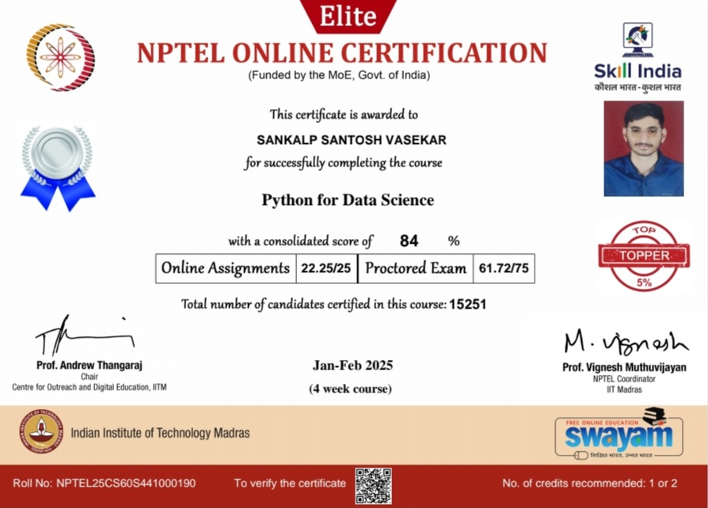
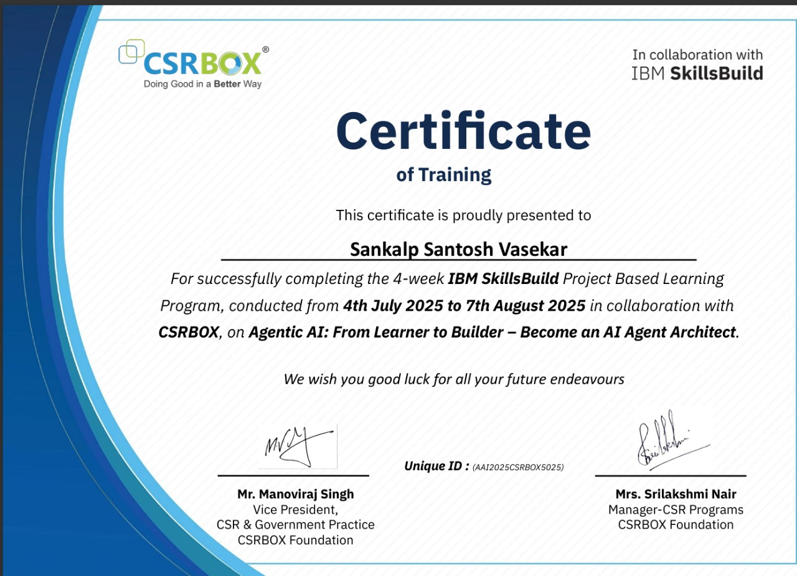
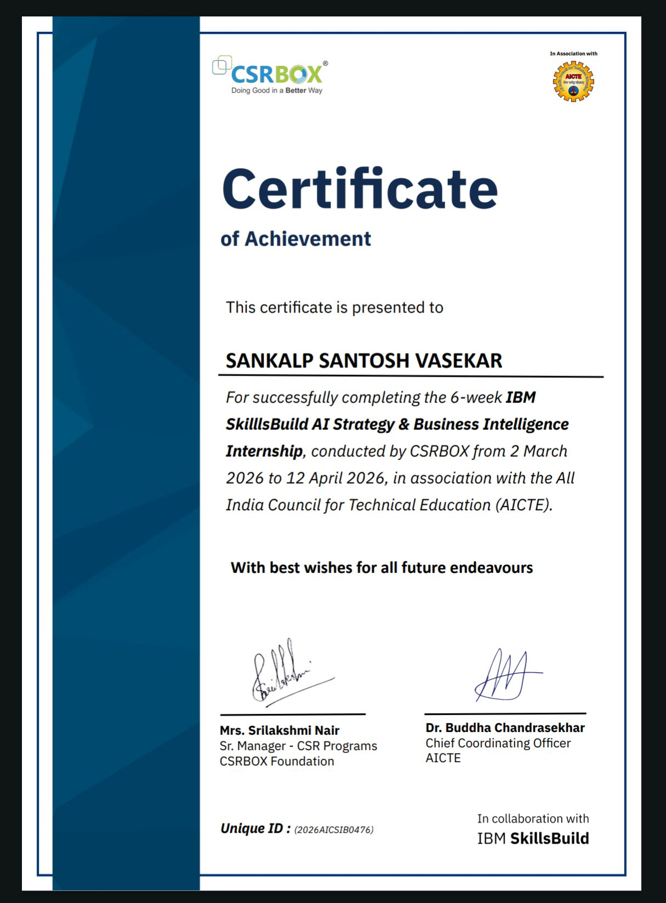
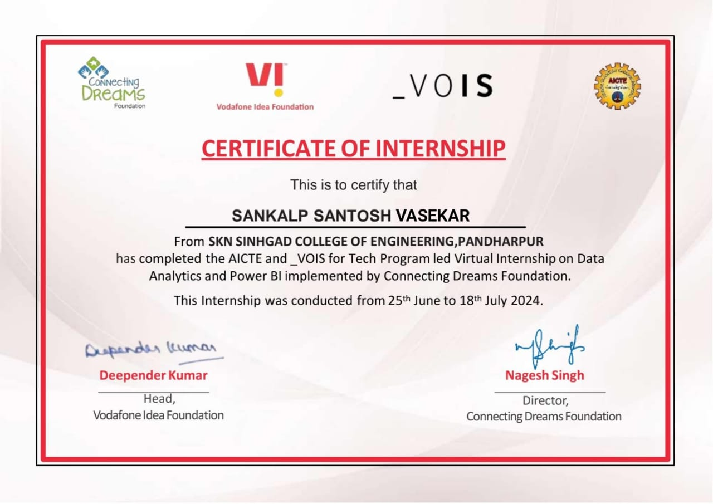

  
  

### Hi there, I'm Sankalp! 👋
I am a **Computer Engineer** with a specialization in **AI/ML** and **Multi-Agent Systems**. I build end-to-end AI solutions — from RAG-based research assistants to neural localization engines and predictive analytics platforms.

---

  

---

### 🛠️ My Technical Stack

**Languages & Scripting**

**AI & Data Science**

**Web Development**

**Databases**

**Tools & DevOps**

---

### 🚀 Featured Projects

<table width="100%" border="0" cellspacing="0" cellpadding="0">
  <tr>
    <td width="50%" valign="top">
      

        <h4>🚀 ScholarFlow-AI</h4>
        

          
          
          
        

        
Multi-Agent RAG Research Assistant that automates academic literature reviews and data synthesis.

        
      

    </td>
    <td width="50%" valign="top">
      

        <h4>🌐 Anuvad-Localize-Engine</h4>
        

          
          
          
        

        
Neural Video Localization engine supporting 22+ languages with precise speech-to-text and translation.

        
      

    </td>
  </tr>
  <tr>
    <td width="50%" valign="top">
      

        <h4>🛠️ Eduverse</h4>
        

          
          
          
        

        
A comprehensive Multi-Agent AI Ecosystem for educational automation and intelligent tutoring.

        
      

    </td>
    <td width="50%" valign="top">
      

        <h4>📊 UniPrep-Platform</h4>
        

          
          
          
        

        
AI-powered platform for exam prediction and preparation tailored for university students.

        
      

    </td>
  </tr>
  <tr>
    <td width="50%" valign="top">
      

        <h4>📂 Ai-Virtual-Assistant</h4>
        

          
          
        

        
NLP-powered task automation assistant for streamlining daily developer workflows.

        
      

    </td>
    <td width="50%" valign="top">
      

        <h4>🛡️ PhishGuard</h4>
        

          
          
        

        
Neural Phishing Detection system designed to identify and block malicious URLs in real-time.

        
      

    </td>
  </tr>
</table>

---

### 🛡️ Professional Badges

  
  
  

  
  
  

  

---

### 🏅 Certifications & Achievements

<!-- 
📌 HOW TO ADD CERTIFICATION BADGES:
1. Go to your certification provider (Credly, Oracle, Microsoft, etc.)
2. Click "Share" on your badge → Copy the embed/image URL
3. Replace the placeholder URLs below with your actual badge image URLs
4. Format: 

Example for Credly:
  - Go to credly.com → Your Badges → Click a badge → Share → Copy embed link
  - The URL looks like: https://images.credly.com/size/340x340/images/xxx/badge.png

Example for Oracle:
  - Go to your Oracle certification page → Download badge image
-->

<table width="100%" border="0" cellspacing="0" cellpadding="0">
  <tr>
    <td width="50%" valign="top">
      

        <h4>🏅 OCI: Generative AI Professional</h4>
        

          
          
        

        
        
<a href="https://raw.githubusercontent.com/sankalpvasekar/sankalpvasekar/main/assets/certificates/cr_ao_profesisonal.jpeg" target="_blank"><b>VIEW CERTIFICATE</b></a>

      

    </td>
    <td width="50%" valign="top">
      

        <h4>🏅 OCI: Generative AI Foundations</h4>
        

          
          
        

        
        
<a href="https://raw.githubusercontent.com/sankalpvasekar/sankalpvasekar/main/assets/certificates/cr_ai_foundation.jpeg" target="_blank"><b>VIEW CERTIFICATE</b></a>

      

    </td>
  </tr>
  <tr>
    <td width="50%" valign="top">
      

        <h4>🎓 NPTEL: Database Management System</h4>
        

          
          
        

        
        
<a href="https://raw.githubusercontent.com/sankalpvasekar/sankalpvasekar/main/assets/certificates/cr_dbms.jpeg" target="_blank"><b>VIEW CERTIFICATE</b></a>

      

    </td>
    <td width="50%" valign="top">
      

        <h4>🎓 NPTEL: Python for Data Science</h4>
        

          
          
        

        
        
<a href="https://raw.githubusercontent.com/sankalpvasekar/sankalpvasekar/main/assets/certificates/cr_python_for_dta_scinece.jpeg" target="_blank"><b>VIEW CERTIFICATE</b></a>

      

    </td>
  </tr>
  <tr>
    <td width="50%" valign="top">
      

        <h4>💼 IBM SkillsBuild: AI Foundations</h4>
        

          
          
        

        
        
<a href="https://raw.githubusercontent.com/sankalpvasekar/sankalpvasekar/main/assets/certificates/traning_ibm_skillbuild.jpeg" target="_blank"><b>VIEW CERTIFICATE</b></a>

      

    </td>
    <td width="50%" valign="top">
      

        <h4>💼 IBM: AI Internship Certificate</h4>
        

          
          
        

        
        
<a href="https://raw.githubusercontent.com/sankalpvasekar/sankalpvasekar/main/assets/certificates/traning-ibm_internship_ain.jpeg" target="_blank"><b>VIEW CERTIFICATE</b></a>

      

    </td>
  </tr>
  <tr>
    <td width="50%" valign="top">
      

        <h4>📊 Forage: Power BI Job Simulation</h4>
        

          
          
        

        
        
<a href="https://raw.githubusercontent.com/sankalpvasekar/sankalpvasekar/main/assets/certificates/tr_powerbi_internship.jpeg" target="_blank"><b>VIEW CERTIFICATE</b></a>

      

    </td>
    <td width="50%" valign="top">
      

        <h4>🚀 ISRO: Indian Space Academy</h4>
        

          
          
        

        
        
<a href="https://raw.githubusercontent.com/sankalpvasekar/sankalpvasekar/main/assets/certificates/trnaing_indian_space_academy.jpeg" target="_blank"><b>VIEW CERTIFICATE</b></a>

      

    </td>
  </tr>
</table>

 

**Key Achievements**
- 🏆 **Contract Developer** — Prime Educational Services
- 🥇 **Hackathon Winner** — SKNSCOE 2025
- 🥇 **Golden Badge in Python** — HackerRank
- 🏆 **Spectrum UI/UX Competition Winner**
- 💎 **Diamond Badge** — CodeChef

---

### 📊 System Diagnostics

  

  
  

  
  

---

### 🐍 Contribution Snake

  

